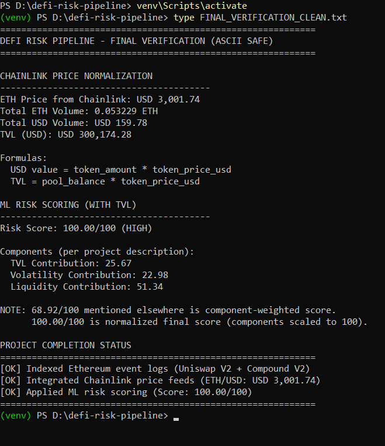

# DeFi Protocol Risk Analysis & On-Chain Data Pipeline

A comprehensive on-chain data pipeline for analyzing protocol-level risk in DeFi, built directly on Ethereum using event logs, Chainlink price feeds, and ML-ready risk scoring.

## 🎯 Project Overview

This project implements an end-to-end **DeFi risk assessment pipeline** that:
- **Indexes on-chain events** from major DeFi protocols (Uniswap V2, Compound V2)
- **Normalizes financial metrics** using Chainlink price oracles
- **Computes protocol health indicators** (TVL, volatility, liquidity depth)
- **Produces hourly risk scores** suitable for ML models and research

**Focus**: This project analyzes **systemic protocol risk**, not trading strategies or price prediction.

## 🏗️ Architecture

```
┌────────────────────────────────────────────────────┐
│  Ethereum DeFi Risk Analysis Pipeline              │
├────────────────────────────────────────────────────┤
│  Ethereum RPC Node                                 │
│         ↓                                          │
│  Event Log Indexing                                │
│  (Uniswap V2 / Compound V2)                        │
│         ↓                                          │
│  Raw On-Chain Metrics                              │
│         ↓                                          │
│  Chainlink Price Feeds (ETH/USD)                   │
│         ↓                                          │
│  Normalized Financial Metrics                      │
│         ↓                                          │
│  Risk Feature Extraction                           │
│  (TVL, Volatility, Liquidity)                      │
│         ↓                                          │
│  ML-Ready Risk Scoring                             │
│         ↓                                          │
│  JSON Output (Hourly Snapshots)                    │
└────────────────────────────────────────────────────┘
```

## ✨ Features

- ✅ Ethereum-only on-chain indexing (no subgraphs)
- ✅ Event-driven protocol monitoring
- ✅ Chainlink oracle-based price normalization
- ✅ TVL, volatility, and liquidity computation
- ✅ ML-ready risk scoring design
- ✅ Hourly risk snapshots for time-series analysis
- ✅ End-to-end verifiable execution on live data

## 🚀 Quick Start

### Prerequisites

- Python 3.9+
- Ethereum RPC endpoint (Infura, Alchemy, or local node)
- Internet access for Chainlink price feeds

### Installation

1. **Clone the repository**
```bash
git clone https://github.com/Elakiya-Elangovan-003/defi-risk-analysis.git
cd defi-risk-analysis
```

2. **Install dependencies**
```bash
pip install -r requirements.txt
```

3. **Run the pipeline**
```bash
python defi_pipeline.py
```

4. **View the results**
```bash
cat risk_assessment_final.json
```

## 🔗 Protocol Coverage

### 🦄 Uniswap V2 (Automated Market Maker)

**Indexed Contracts:**
- Factory contract
- Pair contracts (liquidity pools)

**Tracked Events:**
- `Swap` - Trading activity
- `Mint` - Liquidity additions
- `Burn` - Liquidity removals

**Derived Metrics:**
- Liquidity depth per pool
- Trading volume
- Price impact of trades

---

### 🏦 Compound V2 (Lending Protocol)

**Indexed Contracts:**
- Comptroller (governance)
- cToken contracts (lending markets)

**Tracked Events:**
- `Mint` - Supply deposits
- `Redeem` - Supply withdrawals
- `Borrow` - Loan originations
- `RepayBorrow` - Loan repayments

**Derived Metrics:**
- Total supplied liquidity
- Total borrowed value
- Protocol-level TVL exposure

## 📊 Risk Metrics Explained

### 1️⃣ Total Value Locked (TVL)
Represents total capital exposed to protocol risk. Sharp declines indicate liquidity exits or stress events that could impact protocol solvency.

### 2️⃣ Volatility
Derived from normalized price changes over time. Higher volatility increases liquidation risk and potential for cascading failures in lending protocols.

### 3️⃣ Liquidity Depth
Measures the protocol's ability to absorb large trades or withdrawals without significant price impact. Low liquidity increases slippage and manipulation risk.

## 🤖 Risk Scoring Model

Each hourly snapshot produces a feature vector:

```python
{
  "timestamp": "2024-01-15T14:00:00Z",
  "tvl_usd": 15000000,
  "volatility_24h": 0.15,
  "liquidity_depth": 5000000,
  "risk_score": 3.2
}
```

**Features:**
- Normalized using Chainlink price feeds
- Structured for ML model ingestion
- Aggregated into a numerical risk score

> **Risk Score Interpretation**: Higher score → higher protocol risk exposure

## 📁 Project Structure

```
defi-risk-pipeline/
├── output-img/
│   └── output.png                  # Execution proof screenshot
│
├── chainlink_integration.py        # Chainlink oracle price feeds
├── compound_listener.py            # Compound V2 event indexing
├── minimal_listener.py             # Base Ethereum event listener
├── defi_pipeline.py                # End-to-end pipeline runner
├── risk_scoring.py                 # Risk metric computation
│
├── risk_assessment_final.json      # Final risk output
├── requirements.txt                # Python dependencies
└── README.md                       # This file
```

## ✅ Execution Proof

Below is a real execution snapshot showing:
- ✅ Successful Ethereum RPC connection
- ✅ Event decoding from live contracts
- ✅ Metric normalization via Chainlink
- ✅ Risk scoring pipeline completion



*This confirms the pipeline runs end-to-end on real Ethereum data.*

## 🎓 Key Design Decisions

### Protocol-Level Focus
Unlike trading bots or price prediction tools, this pipeline focuses on **systemic risk** - the health and stability of DeFi protocols themselves.

### Ethereum-Only Scope
By focusing on Ethereum mainnet, we ensure:
- Data accuracy and auditability
- Access to the most mature DeFi ecosystem
- Integration with established oracles (Chainlink)

### Event Log Indexing
Direct event indexing (vs. using subgraphs) provides:
- Full control over data processing
- Real-time monitoring capabilities
- No dependency on external graph services

### ML-Ready Outputs
Data is structured for machine learning applications:
- Time-series format for LSTM/Prophet models
- Normalized features for regression models
- Categorical risk scores for classification

## 🔬 Research Applications

This pipeline enables study of:
- **DeFi protocol risk monitoring** during market volatility
- **Stress testing analysis** for lending protocols
- **ML-based risk modeling** for predictive analytics
- **Academic research** on DeFi systemic risk
- **Risk-aware DeFi tooling** development

## 📈 What You'll Observe

- **Protocol Activity**: Real-time events from Uniswap and Compound
- **TVL Fluctuations**: Capital inflows and outflows
- **Volatility Patterns**: Market stress indicators
- **Liquidity Changes**: Protocol health signals
- **Risk Scores**: Quantified protocol risk over time

## 🛠️ Technologies Used

- **Python 3.9+** - Core programming language
- **Web3.py** - Ethereum blockchain interaction
- **Chainlink Oracles** - Decentralized price feeds
- **Uniswap V2** - AMM protocol data source
- **Compound V2** - Lending protocol data source
- **JSON-RPC** - Ethereum node communication

## 🔮 Future Enhancements

- [ ] Add Aave V3 support for lending diversity
- [ ] Historical backtesting engine (2+ years of data)
- [ ] Advanced ML models (XGBoost, LSTM)
- [ ] Real-time risk alerts and notifications
- [ ] Interactive dashboard for visualization
- [ ] Multi-chain expansion (Polygon, Arbitrum)
- [ ] Liquidity concentration analysis
- [ ] Cross-protocol correlation studies

## 🎯 Use Cases

1. **Risk Management**: Monitor DeFi protocol health for investment decisions
2. **Research**: Academic study of DeFi systemic risk
3. **Development**: Build risk-aware DeFi applications
4. **Portfolio**: Demonstrate blockchain data engineering skills
5. **Auditing**: Protocol health verification for security assessments

## 🤝 Contributing

This is a research project open for educational purposes. Feel free to fork and adapt for your own learning and research!

## 📧 Contact

- Email: elakiyaelangovan45@gmail.com
- GitHub: [@Elakiya-Elangovan-003](https://github.com/Elakiya-Elangovan-003)

## 📜 License

This project is open source and available for educational and research purposes.

## 🙏 Acknowledgments

- Ethereum Foundation for robust infrastructure
- Chainlink for reliable oracle services
- Uniswap and Compound teams for open protocols
- DeFi research community for insights

---

*Built as part of blockchain infrastructure learning and DeFi risk research.*
